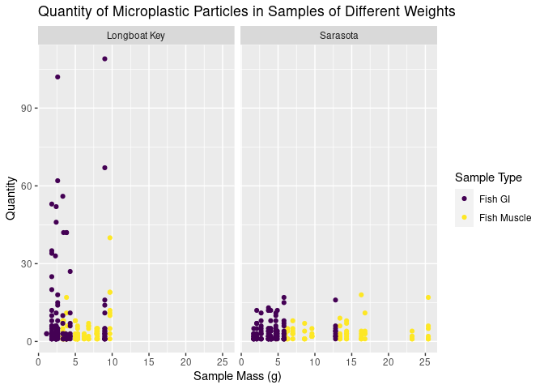
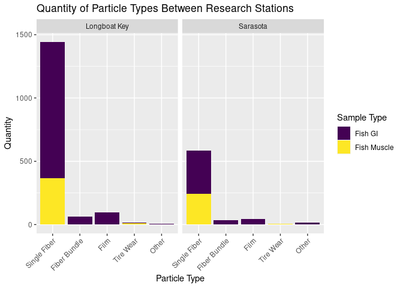
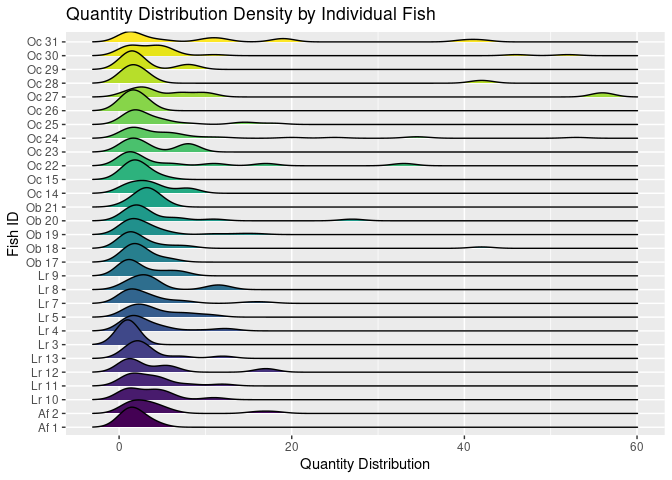
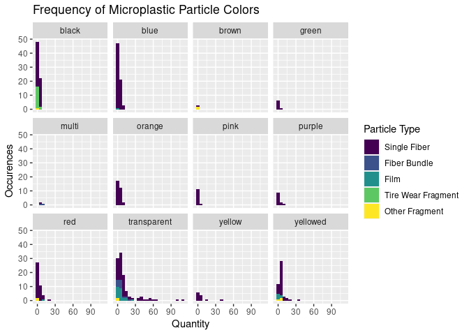

Fish Microplastics Analysis
================
Mabon Young, John Calzini, and Gordon Maguire
2/7/2024

## Load packages and data

``` r
# install.packages("tidyverse")
# install.packages("readxl")
# install.packages("janitor")

library(tidyverse)
library(readxl)
library(janitor)
library(RColorBrewer)
library(forcats)
library(ggridges)
```

``` r
fish_microplastics <- read_xlsx("data/Fish_Microplastics_Data_Repository.xlsx", 
                                na = "NA") %>%
  janitor::clean_names() 

glimpse(fish_microplastics) 
```

    ## Rows: 420
    ## Columns: 16
    ## $ sample_batch                 <chr> "Sept 2022", "Sept 2022", "Sept 2022", "S…
    ## $ fish_id                      <chr> "Oc 31", "Oc 31", "Oc 31", "Oc 31", "Oc 3…
    ## $ sieve_size                   <chr> NA, NA, NA, NA, NA, NA, NA, NA, NA, NA, N…
    ## $ number_fractions             <dbl> 1, 1, 1, 1, 1, 1, 1, 1, 1, 1, 1, 1, 1, 1,…
    ## $ sample_label                 <chr> "Oc_31_11142_201022_F", "Oc_31_11142_2010…
    ## $ sample_type                  <chr> "Fish Muscle", "Fish Muscle", "Fish Muscl…
    ## $ net_sample_mass_g            <dbl> 9.7, 9.7, 9.7, 9.7, 9.7, 9.7, 9.7, 9.7, 9…
    ## $ dissection_collection_date   <dttm> 2022-10-20, 2022-10-20, 2022-10-20, 2022…
    ## $ dissection_or_field_blank_id <chr> "Dissection_blank_201022_MP", "Dissection…
    ## $ digestion_blank_id           <chr> "Digestion_blank_102022", "Digestion_blan…
    ## $ particle_type                <chr> "Fiber_single", "Fiber_single", "Fiber_si…
    ## $ color                        <chr> "black", "transparent", "red", "yellow", …
    ## $ quantity                     <dbl> 3, 19, 19, 40, 5, 1, 12, 11, 10, 2, 2, 2,…
    ## $ hot_needle                   <chr> "yes", "yes", "yes", "yes", "yes", "yes",…
    ## $ collection_lat               <dbl> 27.42136, 27.42136, 27.42136, 27.42136, 2…
    ## $ collection_long              <dbl> -82.64988, -82.64988, -82.64988, -82.6498…

``` r
#Sieve size is still a character, some of the entries have um after them, will need to figure out how to fix that later. Could also convert hot needle into a logical vector.
```

``` r
fish_microplastics <- fish_microplastics %>%
  mutate(sieve_size = str_extract(sieve_size, pattern = "[:digit:]+")) %>%
  mutate(sieve_size = case_when(sieve_size == "LG" ~ 777,
          TRUE ~ as.numeric(sieve_size))) %>%
  mutate(hot_needle = case_when(hot_needle == "yes" ~ TRUE, hot_needle == "no" ~ FALSE))
```

``` r
ggplot(data = fish_microplastics, mapping = aes(x = net_sample_mass_g)) +
  geom_histogram(binwidth = 1000) + 
  facet_wrap(~color) 
```


``` r
#You could also present this information in a bar graph, a histogram with a binwidth of 1000 will always be just 1 bar. Also, I wonder why we're seeing negative values? It's probably a result of overly large binwidth, but maybe ask Laurie about that.

ggplot(data = fish_microplastics, mapping = aes(x = net_sample_mass_g)) +
  geom_histogram(binwidth = 5) + 
  facet_wrap(~color) 
```


``` r
# This graph still isn't telling us that much; remember, the net sample mass isn't the mass of the plastic, it's the mass of the sample the plastic was taken from. It could still be helpful if we wanted to look at microplastic density, though! 
plastic_dens <- fish_microplastics %>%
  group_by(fish_id) %>%
  reframe(plastic_density = sum(quantity)/net_sample_mass_g, na.rm = TRUE, sample_type) %>%
  distinct(fish_id, sample_type, plastic_density)

fish_microplastics_dens <- fish_microplastics %>%
  mutate(plastic_density = quantity/net_sample_mass_g)
```

``` r
fish_microplastics %>%
  group_by(color) %>%
  summarize(
    avg_ht = mean(quantity, na.rm = TRUE)
    ) %>% 
  arrange(desc(avg_ht)) %>% 
slice(1:5) 
```

    ## # A tibble: 5 × 2
    ##   color       avg_ht
    ##   <chr>        <dbl>
    ## 1 transparent  12.4 
    ## 2 multi         7   
    ## 3 yellow        6.67
    ## 4 yellowed      5.60
    ## 5 red           3.05

``` r
fish_microplastics %>% 
group_by(color) %>%
  summarize(
    avg_ht = mean(quantity, na.rm = TRUE), median = median(quantity, na.rm = TRUE), min = min(quantity, na.rm = TRUE), max = max(quantity, na.rm = TRUE), sd = sd(quantity, na.rm = TRUE), IQR = IQR(quantity, na.rm = TRUE)
    )
```

    ## # A tibble: 12 × 7
    ##    color       avg_ht median   min   max     sd   IQR
    ##    <chr>        <dbl>  <dbl> <dbl> <dbl>  <dbl> <dbl>
    ##  1 black         2.1     1       1     7  1.49    2  
    ##  2 blue          2.56    2       1    12  2.10    2  
    ##  3 brown         1       1       1     1  0       0  
    ##  4 green         1.57    1       1     4  1.13    0.5
    ##  5 multi         7       5       5    11  3.46    3  
    ##  6 orange        2.87    2       1    10  2.22    3  
    ##  7 pink          1.5     1       1     4  0.905   1  
    ##  8 purple        2.58    1.5     1    11  2.87    1.5
    ##  9 red           3.05    2       1    19  3.54    2  
    ## 10 transparent  12.4     6       1   109 19.1    10  
    ## 11 yellow        6.67    2.5     1    40 11.2     2.5
    ## 12 yellowed      5.60    4       1    34  5.97    4

``` r
#That 109 one is a bit terrifying... maybe we could hone in on that fish and see if there's anything unique about it in the spatial data?
```

``` r
fish_microplastics_full <- fish_microplastics_dens %>%
  mutate(station = case_when(collection_lat == 27.31513 ~ "Sarasota", 
                             collection_lat == 27.42136 ~ "Longboat Key"))
```

``` r
fish_microplastics_full %>%
  ggplot(aes(x = net_sample_mass_g, y = quantity, color = sample_type)) +
  geom_point() +
  facet_wrap(~station) +
  scale_colour_viridis_d() +
  labs( x = "Sample Mass (g)",
        y = "Quantity",
        color = "Sample Type",
        title = "Quantity of Microplastic Particles in Samples of Different Weights"
    )
```

    ## Warning: Removed 1 rows containing missing values (`geom_point()`).



``` r
fish_microplastics_full %>%
  drop_na(particle_type) %>%
  ggplot(aes(x = fct_relevel(particle_type, "Fiber_single", "Fiber_bundle", "Film", "Fragment_TWP", "Fragment_nonTWP" ), y = quantity, fill = sample_type)) +
  geom_col() +
  facet_wrap(~station) +
  scale_x_discrete(labels = c("Single Fiber", "Fiber Bundle", "Film", "Tire Wear", "Other")) +
  theme(axis.text.x = element_text(angle = 45, vjust = 1, hjust=1)) +
  scale_fill_viridis_d() +
  labs(x = "Particle Type", 
       y = "Quantity", 
       fill = "Sample Type",
       title = "Quantity of Particle Types Between Research Stations" )
```

    ## Warning: Removed 1 rows containing missing values (`position_stack()`).



``` r
fish_microplastics %>%
  group_by(fish_id) %>%
  filter(quantity < 60) %>%
  ggplot(aes(x = quantity, y = fish_id, fill = fish_id, show.legend = FALSE)) +
  geom_density_ridges() +
  theme(legend.position = "none") +
  scale_fill_viridis_d() +
  labs(x = "Quantity Distribution",
       y = "Fish ID",
       title = "Quantity Distribution Density by Individual Fish")
```

    ## Picking joint bandwidth of 1.34



``` r
# color.labs <- c("Black", "Blue", "Brown", "Green", "Multi", "Orange", "Pink", "Purple", "Red", "Transparent", "Yellow", "Yellowed")
# names(color.labs) <- c("Black", "Blue", "Brown", "Green", "Multi", "Orange", "Pink", "Purple", "Red", "Transparent", "Yellow", "Yellowed")

fish_microplastics %>%
  drop_na(particle_type) %>%
  ggplot(aes(x = quantity, fill = fct_relevel(particle_type, "Fiber_single", "Fiber_bundle", "Film", "Fragment_TWP", "Fragment_nonTWP" ))) +
  geom_histogram(binwidth = 5) + 
  facet_wrap(~color) +
  scale_fill_viridis_d(labels = c("Single Fiber", "Fiber Bundle", "Film", "Tire Wear Fragment", "Other Fragment")) +
  labs(x = "Quantity",
       y = "Occurences",
       title = "Frequency of Microplastic Particle Colors",
       fill = "Particle Type")
```

    ## Warning: Removed 1 rows containing non-finite values (`stat_bin()`).


