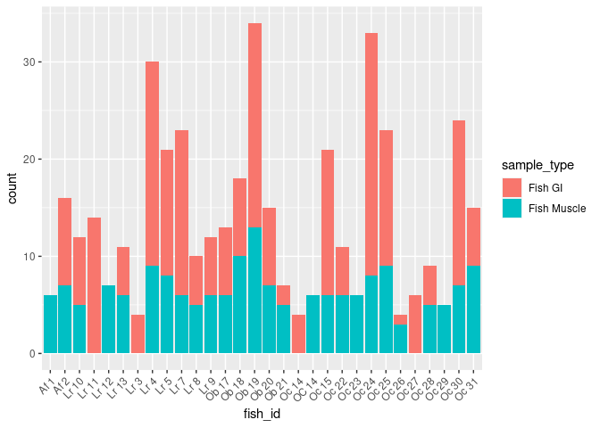
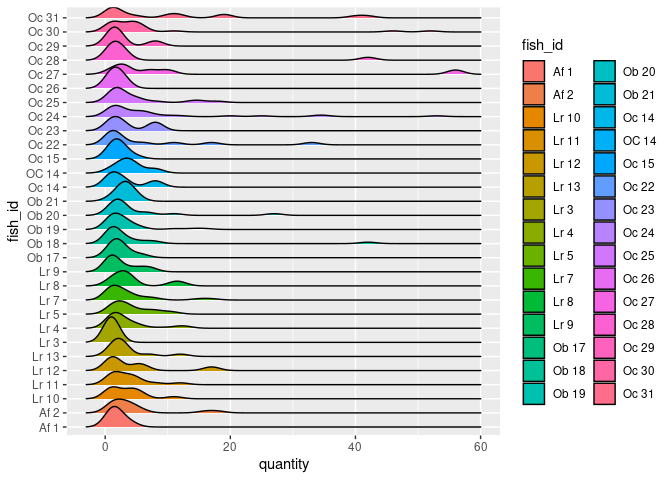

Project proposal
================
THE Triangle

``` r
library(tidyverse)
library(readxl)
library(janitor)
library(broom)
library(ggridges)
library(leaflet)
library(htmltools)
library(sf)
```

## 1. Introduction

Microplastics have become more and more well known throughout the world
in the past few years. We now recognize that they are an incredibly
dangerous byproduct to marine life and many organizations have begun to
investigate the problem. That is what this project is about. Our project
will be looking at a 2023 dataset by Leslie Hart of microplastic samples
in prey fish caught in Sarasota Bay. The samples were extracted from
muscle tissue and GI tracts of the fish, and sorted by size, type,
color, and quantity.

Questions: Is there a discrepancy in the amount of microplastics in
different locations of the fish? Does the size of the fragment have a
relationship to the location? Are larger fragments found in the muscle
or in the GI tract?

## 2. Data

``` r
fish_microplastics <- read_xlsx("../data/Fish_Microplastics_Data_Repository.xlsx", 
                                na = "NA") %>%
  janitor::clean_names() 

fish_microplastics <- fish_microplastics %>%
  mutate(sieve_size = str_extract(sieve_size, pattern = "[:digit:]+")) %>%
  mutate(sieve_size = case_when(sieve_size == "LG" ~ 777,
          TRUE ~ as.numeric(sieve_size))) %>%
  mutate(hot_needle = case_when(hot_needle == "yes" ~ TRUE, hot_needle == "no" ~ FALSE))
```

``` r
glimpse(fish_microplastics)
```

    ## Rows: 420
    ## Columns: 16
    ## $ sample_batch                 <chr> "Sept 2022", "Sept 2022", "Sept 2022", "S…
    ## $ fish_id                      <chr> "Oc 31", "Oc 31", "Oc 31", "Oc 31", "Oc 3…
    ## $ sieve_size                   <dbl> NA, NA, NA, NA, NA, NA, NA, NA, NA, NA, N…
    ## $ number_fractions             <dbl> 1, 1, 1, 1, 1, 1, 1, 1, 1, 1, 1, 1, 1, 1,…
    ## $ sample_label                 <chr> "Oc_31_11142_201022_F", "Oc_31_11142_2010…
    ## $ sample_type                  <chr> "Fish Muscle", "Fish Muscle", "Fish Muscl…
    ## $ net_sample_mass_g            <dbl> 9.7, 9.7, 9.7, 9.7, 9.7, 9.7, 9.7, 9.7, 9…
    ## $ dissection_collection_date   <dttm> 2022-10-20, 2022-10-20, 2022-10-20, 2022…
    ## $ dissection_or_field_blank_id <chr> "Dissection_blank_201022_MP", "Dissection…
    ## $ digestion_blank_id           <chr> "Digestion_blank_102022", "Digestion_blan…
    ## $ particle_type                <chr> "Fiber_single", "Fiber_single", "Fiber_si…
    ## $ color                        <chr> "black", "transparent", "red", "yellow", …
    ## $ quantity                     <dbl> 3, 19, 19, 40, 5, 1, 12, 11, 10, 2, 2, 2,…
    ## $ hot_needle                   <lgl> TRUE, TRUE, TRUE, TRUE, TRUE, TRUE, TRUE,…
    ## $ collection_lat               <dbl> 27.42136, 27.42136, 27.42136, 27.42136, 2…
    ## $ collection_long              <dbl> -82.64988, -82.64988, -82.64988, -82.6498…

## 3. Ethics review

## 4. Data analysis plan

With the data, we plan on plotting it in a spatial manner using Leaflet.
We want to see “in relation to the species type, is there any
correlation to the quantity and sample mass of the microplastic particle
type?”. As well as asking the question of “does the color of the
microplastic lend any correlation to the distribution and placement in
the sample type?”. The combination of these to questions might allow us
to understand if there correlation between different fish and the
average count of microplastics found within Sarasota Bay. It would be
interesting to see if multiple variables like the distinct IDs and the
average count have any correlation.

``` r
fish_microplastics %>%
  group_by(fish_id) %>%
  ggplot(aes(x = fish_id, fill = sample_type)) +
  geom_bar() +
  theme(axis.text.x = element_text(angle = 45, vjust = 1, hjust=1))
```



``` r
fish_microplastics %>%
  group_by(fish_id) %>%
  ggplot(aes(x = quantity, y = fish_id, fill = fish_id)) +
  geom_density_ridges()
```

    ## Picking joint bandwidth of 1.37

    ## Warning: Removed 1 rows containing non-finite values (`stat_density_ridges()`).


